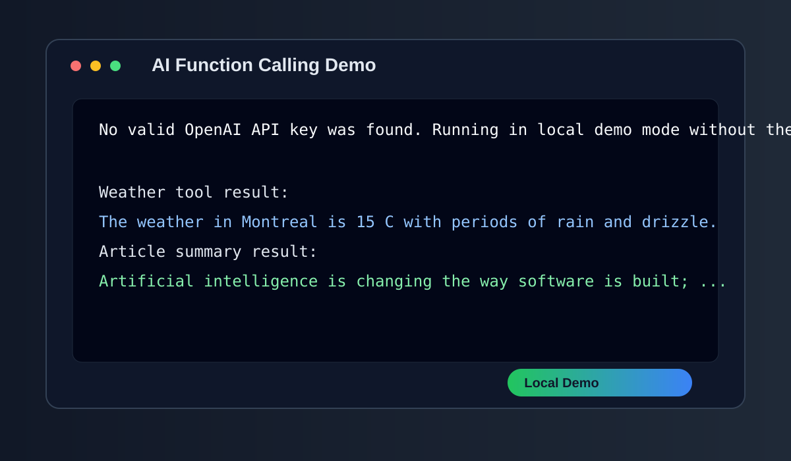
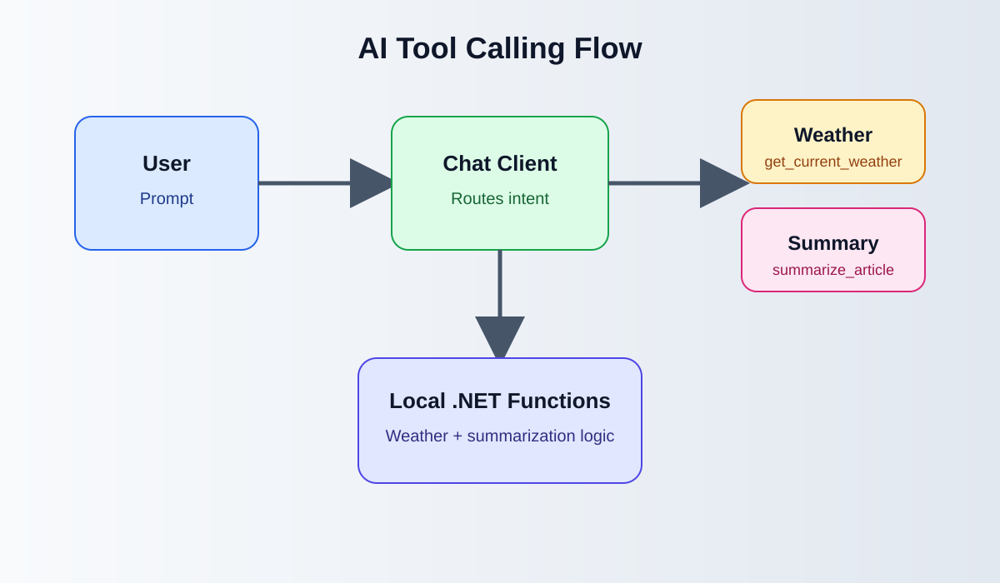

# AI-implementations
Invoke .NET functions using an AI model.

This sample demonstrates a .NET console app that registers local functions for the AI model to call. It includes:
- a weather tool
- an article summarization helper
- a chat client built with Microsoft.Extensions.AI and the OpenAI SDK

## Run the sample

1. Set your OpenAI user secrets:
   ```bash
   dotnet user-secrets init
   dotnet user-secrets set "ModelName" "gpt-5"
   dotnet user-secrets set "OpenAIKey" "<your-openai-api-key>"
   ```
2. Run the app:
   ```bash
   dotnet run
   ```

## What the app does

The app shows how an AI model can invoke local .NET functions while responding to user prompts. For example, it can:
- answer weather questions using a function
- summarize an article using a local summarization function

This is a practical pattern for tool calling and function invocation in .NET AI apps.

## Screenshots

### Local demo mode



### Tool calling flow


